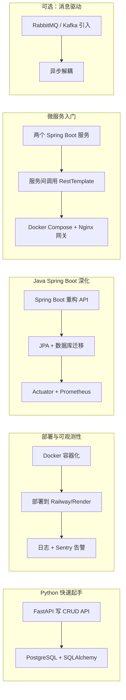

以下是您需要的完整后端学习路线图的 Markdown 格式内容。您可以直接复制保存为 `.md` 文件。

```markdown
# iOS 程序员学习后端技术栈（Python/Java 基础版）完整路线图

> 适用人群：有 Python / Java 基础，同时具备 iOS 开发经验的工程师  
> 总时长建议：8~12 周（业余时间）

## 总路线图



---

## 第一阶段：Python 快速打通 “API + 数据库” 闭环

**时长**：2~3 周  
**目标**：写出第一个生产级 REST API，连接真实数据库，理解 ORM 与数据库迁移。

### 技术栈
- 语言：Python 3.10+
- 框架：FastAPI
- 数据库：PostgreSQL（通过 Docker 运行）
- ORM：SQLAlchemy + Alembic
- 工具：Postman / curl，psql

### 实践步骤
1. 安装依赖：
   ```bash
   pip install fastapi uvicorn sqlalchemy psycopg2-binary alembic
   ```
2. 用 Docker 启动 PostgreSQL：
   ```bash
   docker run --name postgres -e POSTGRES_PASSWORD=password -p 5432:5432 -d postgres
   ```
3. 创建 FastAPI 项目，定义 `User` 模型（id, name, email）。
4. 使用 Alembic 初始化迁移并生成表结构。
5. 实现 `GET /users` 和 `POST /users` 接口，在依赖函数中获取数据库会话。
6. 用 Postman 验证接口读写数据库。

### iOS 类比理解
- FastAPI 路由装饰器 → iOS 中 `URLSession` 对不同 endpoint 的处理。
- 依赖注入 `Depends(get_db)` → 类似 `@IBOutlet` 或构造注入。
- Alembic 迁移 → CoreData 的 `NSManagedObjectModel` 版本迁移，但更显式。

### 产出
一个本地运行、数据持久化的用户 API，可直接被 iOS App 通过 `http://localhost:8000/users` 调用。

---

## 第二阶段：部署 + 日志 + 告警 —— 让服务“可运维”

**时长**：2 周  
**目标**：容器化部署到云端，输出结构化日志，配置错误监控和可用性告警。

### 技术栈
- 容器化：Docker
- 云平台：Railway.app 或 Render.com
- 日志：Python `logging` + `python-json-logger`
- 告警/监控：Sentry（错误）+ UptimeRobot（可用性）

### 实践步骤
1. 编写 `Dockerfile`（参考 FastAPI 官方模板），本地构建并运行容器。
2. 部署到 Railway：
   - 连接 GitHub 仓库，一键部署。
   - 设置环境变量 `DATABASE_URL`（使用 Railway 自带 PostgreSQL 或外部数据库）。
3. 添加结构化日志中间件：输出请求方法、路径、耗时、用户 ID（如有），格式为 JSON。
4. 集成 Sentry：
   - 注册 Sentry，获得 DSN。
   - 在 FastAPI 中初始化 `sentry_sdk`，添加 `SentryFastApiMiddleware`。
   - 故意制造异常，验证 Sentry 收到错误并配置邮件/钉钉告警。
5. 实现 `/health` 端点（返回 200 OK）。
6. 注册 UptimeRobot，添加监控任务每 5 分钟访问 `/health`，失败时发送告警。

### iOS 类比理解
- Sentry → 类似 Crashlytics，但能捕获逻辑异常。
- UptimeRobot → 类似苹果“夜间诊断”，但可自定义频率。
- 结构化日志（JSON）→ 对应 iOS 中 `os_log` 配合 `log collect`。

### 产出
一个 **7×24 小时在线**、异常自动告警、日志可查的云端 API。

---

## 第三阶段：Java Spring Boot 重写 —— 深入工业级实践

**时长**：2~3 周  
**目标**：用 Spring Boot 重写 API，掌握 JPA、数据库迁移、Actuator 监控与 Prometheus 集成。

### 技术栈
- 框架：Spring Boot 3.x + Spring Web + Spring Data JPA
- 数据库：PostgreSQL
- 迁移工具：Flyway 或 Liquibase
- 监控：Micrometer + Prometheus + Grafana（本地 docker-compose）

### 实践步骤
1. 使用 Spring Initializr 创建项目，勾选：Web, JPA, PostgreSQL, Actuator, Flyway。
2. 编写 `User` 实体和 `UserRepository`（继承 `JpaRepository`）。
3. 编写 `UserController`：`@RestController`，实现 `GET /users` 和 `POST /users`。
4. 配置 Flyway：在 `resources/db/migration` 下创建 `V1__create_user_table.sql`，启动时自动建表。
5. 集成 Actuator：访问 `/actuator/health`、`/actuator/metrics`。
6. 本地用 docker-compose 启动 Prometheus 和 Grafana：
   - 在 Spring Boot 中添加 `micrometer-registry-prometheus` 依赖。
   - 暴露 `/actuator/prometheus` 端点。
   - 配置 Prometheus 抓取该端点。
   - 在 Grafana 中导入 Spring Boot 仪表盘，设置告警规则（如错误率 > 10%）。

### iOS 类比理解
- `JpaRepository` → 类似 Core Data 的 `NSFetchRequest` + `NSManagedObjectContext`。
- `@RestController` → 相当于把 `UIViewController` 和网络层合并，每个方法对应一个 HTTP 方法。
- Flyway → 类似 iOS 中 `NSPersistentCloudKitContainer` 的 schema 版本管理，但使用 SQL 脚本。

### 产出
一个符合企业规范的 Java API 服务，具备健康检查、指标采集、数据库版本管理能力。

---

## 第四阶段：初识微服务 —— 拆与合

**时长**：2 周  
**目标**：将单体拆分为两个微服务，通过 HTTP 通信，使用 Nginx 作为网关。

### 技术栈
- 服务间通信：`RestTemplate` 或 `WebClient`（Spring Cloud OpenFeign 可选）
- 服务发现：docker-compose 内置 DNS（模拟）
- 网关：Nginx

### 实践步骤
1. 新建 `counter-service`（Spring Boot）：提供 `POST /visits` 接口，记录访问次数（存内存或 Redis）。
2. 修改 `user-service`：在创建用户成功后，调用 `counter-service` 的 `/visits` 接口。
3. 编写 `docker-compose.yml`，编排两个服务 + PostgreSQL + Redis（可选）+ Nginx：
   - 服务之间通过服务名访问（如 `http://counter-service:8080/visits`）。
4. 配置 Nginx 作为 API 网关：
   - 监听 80 端口。
   - 路由规则：`/api/users/*` → `user-service:8080`，`/api/counter/*` → `counter-service:8080`。
   - 添加简单限流（`limit_req_zone`）。
5. 运行 `docker-compose up`，通过 Nginx 端口访问所有 API。

### 微服务核心概念
- **服务发现**：docker-compose 内部 DNS 类似动态注册中心。
- **API 网关**：统一处理路由、鉴权、限流、日志，类似 iOS 中的 `UIApplication` 单例。
- **同步调用**：需要处理超时、重试、降级，不同于进程内调用。

### 产出
两个可独立部署、互相协作的微服务 + 一个网关，体验微服务的核心模式。

---

## 第五阶段（可选）：消息队列 —— 异步解耦

**时长**：1~2 周  
**目标**：引入消息队列，实现服务间的异步通信。

### 技术栈
- RabbitMQ 或 Kafka
- Spring AMQP（RabbitMQ） 或 Spring Kafka

### 实践步骤
1. 在 docker-compose 中加入 RabbitMQ。
2. 修改 `user-service`：创建用户后发布 `UserCreatedEvent` 到队列。
3. 修改 `counter-service`：监听队列，消费事件并增加计数。
4. 验证：用户创建后，计数器异步增加，且 `user-service` 不依赖 `counter-service` 的可用性。

### 收益
理解**最终一致性**、**削峰填谷**、服务间解耦。

---

## 学习建议与推荐资料

| 阶段 | 推荐资源 | 重点关注 |
|------|----------|----------|
| Python + FastAPI | [FastAPI 官方教程](https://fastapi.tiangolo.com/tutorial/) | 依赖注入、Pydantic 模型、异步路由 |
| Docker 部署 | [Docker 入门文档](https://docs.docker.com/get-started/) | Dockerfile、镜像分层、端口映射 |
| 日志告警 | [Sentry Python 文档](https://docs.sentry.io/platforms/python/) + [UptimeRobot 教程](https://uptimerobot.com/) | 结构化日志、告警条件 |
| Java Spring Boot | [Spring Boot 官方指南](https://spring.io/guides/gs/rest-service/) | 自动配置、JPA、Actuator |
| 微服务 | [Spring Cloud 中文文档](https://spring.io/projects/spring-cloud) | 服务发现、OpenFeign、网关 |

---

## 最后叮嘱

1. **一定要写代码**：每个阶段产出可运行的项目，放 GitHub 上。
2. **用客户端视角反推**：你写的每个 API 都可以立刻在 iOS 工程中调用，这是最大优势。
3. **不必追求完美**：链路追踪、配置中心等可暂时跳过，先跑通主干。
4. **面试/工作重点**：Spring Boot + JPA + PostgreSQL + 日志监控是后端入门的铁三角，微服务是加分项。

遇到具体问题（如 FastAPI 异步数据库、Spring 事务失效、Docker 网络不通）时，带着错误信息随时提问。加油！